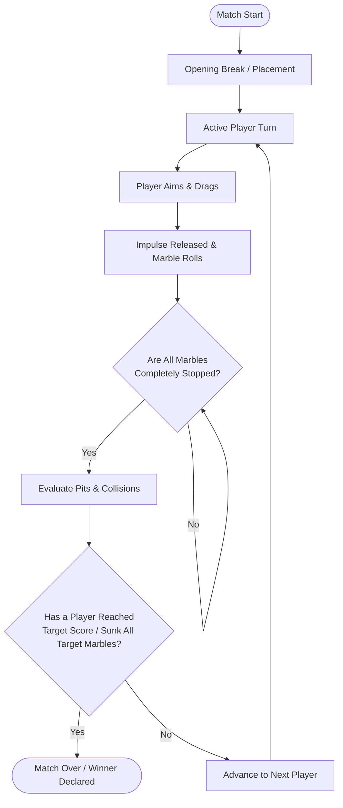

# Pit Striker — Game Design Document (GDD)

## 1. Core Game Loop

## 2. Core Game Mode: Sequential Pit Traversal (Pit 1 → Pit 2 → Pit 3)
As established in the studio concept references ([`Concept_LushVillage_EarthTrack.jpg`](file:///c:/Users/Tisan/Documents/pitstricker/References/Concept_LushVillage_EarthTrack.jpg) and [`Concept_TropicalBeach_HUD.jpg`](file:///c:/Users/Tisan/Documents/pitstricker/References/Concept_TropicalBeach_HUD.jpg)):

* **Sequential Objectives:**
  * The arena features 3 distinct pits numbered **Pit 1**, **Pit 2**, and **Pit 3** (marked with physical flags or HUD badges).
  * Players must sink their marble into **Pit 1 first**, then progress to **Pit 2**, and finally **Pit 3**.
  * Sinking into a later pit before completing the prior one does not count toward progression.
* **The Striker Crown (Endgame):**
  * Once a player completes Pit 3, their marble is crowned as an active "Striker".
  * Strikers can eliminate opponent marbles by direct collision or claim victory.

## 3. Production UI & HUD Specification
* **Top Bar:**
  * **Logo:** *Pit Striker* stylized logo with shooting marble insignia.
  * **Player Roster:** Turn badges for P1 (Blue Swirl), P2 (Red Swirl), P3 (Green Swirl), P4 (Amber Swirl). Active player glows.
  * **Turn & Stage Indicator:** "Your Turn" banner with interactive progress beads `(1) → (2) → (3)`.
  * **Settings Gear:** Quick access to audio, sensitivity, and match restart.
* **Playfield Guides:**
  * **Chalk Placement Ring:** Subtle circular boundary showing the marble's legal rest area.
  * **Directional Arrow / Chevrons:** Glowing segmented arrow projecting from marble center along ground plane.
* **Bottom Controls:**
  * **Left:** Segmented cyan **Power Meter** showing charging impulse force.
  * **Right:** Circular **Strike Button** (with tactile feedback) or direct pull-back release.

## 4. Visual Themes Revealed in Concepts
1. **Rural Earth Track:** Packed loam soil, small pebbles, rustic wooden signage, numbered red flags, lush tropical foliage.
2. **Tropical Beach Shore:** Warm golden sand ripples, turquoise waves, weathered driftwood fishing boat, coastal lighthouse.

