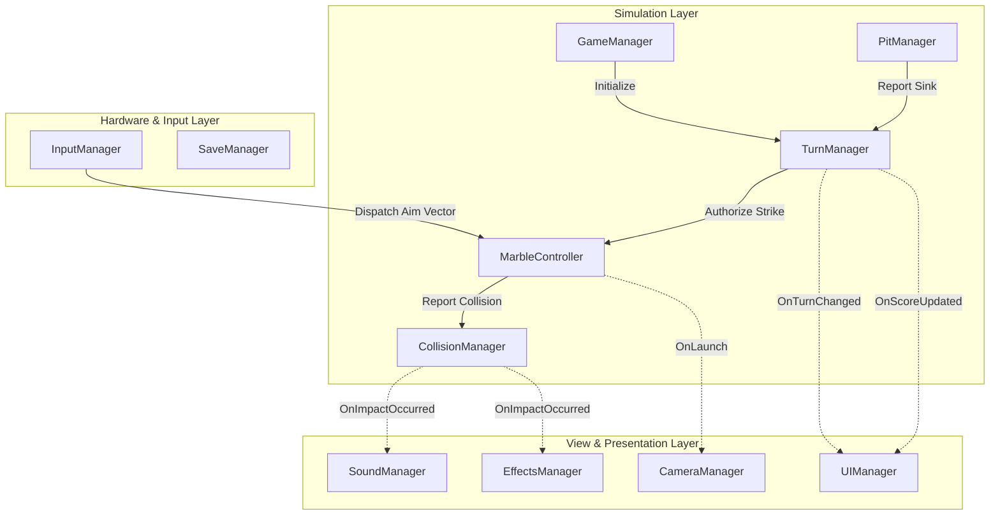

# Pit Striker — Technical Architecture Specification

## 1. System Overview & Pattern Selection
*Pit Striker* utilizes an **Event-Driven Decoupled Architecture**. Systems do not directly invoke each other across architectural boundaries; instead, state changes are announced via C# events and actions, or managed via ScriptableObject channels.

## 2. Manager Subsystems & Boundaries

### 1. `GameManager`
* Top-level state coordinator: Boot, Main Menu, Playing, Round Over, Paused.
* Controls asynchronous scene loading (`SC_MainMenu`, `SC_Gameplay`).

### 2. `TurnManager`
* Holds current match state (turn count, active player index, consecutive bonus strikes).
* Tracks moving rigidbodies in the scene. Locks input until all marble linear velocity < `0.05` and angular velocity < `0.05`.
* Advances turn and invokes `OnTurnChanged`, `OnScoreUpdated`, `OnMatchEnded`.

### 3. `InputManager`
* Converts touch drag gestures on screen to a normalized 3D launch vector $\vec{V}$ and clamped scalar power $P$.
* Exposes cancellation handling (deadzone return).

### 4. `MarbleController`
* Attached to each individual marble prefab.
* Exposes `ApplyStrike(Vector3 direction, float force)`.
* Reports its own velocity state and registers with `TurnManager`.

### 5. `CollisionManager`
* Listens to `OnCollisionEnter` events on marble colliders.
* Analyzes relative velocity of the strike and broadcasts `OnImpactOccurred(Vector3 contactPoint, float impactStrength, CollisionType type)`.

### 6. `PitManager`
* Manages pit trigger zones.
* Validates marble entry height and speed to confirm sinks.
* Invokes `OnPitCaptured(MarbleController marble, int pitId)`.

### 7. `CameraManager`
* Listens to game state events. Transitions Cinemachine Virtual Cameras between Overview, Aiming, and Action Tracking.

### 8. `UIManager`
* Pure presentation layer. Subscribes to `TurnManager` events to refresh scores, player colors, and victory dialogues.

### 9. `SoundManager` & `EffectsManager`
* Subscribe to `CollisionManager` and `TurnManager` to trigger SFX, particle bursts, and Android haptics without touching simulation code.

### 10. `SaveManager` & `SettingsManager`
* Serializes player preferences (sound volumes, haptics, graphics quality) locally using JSON file storage or `PlayerPrefs`.

## 3. Preparation for Online Multiplayer
To transition to networked multiplayer in future phases, the simulation layer remains untouched:
* The `InputManager` on client devices simply serializes `(Vector3 direction, float force)` across the network.
* The authoritative host runs the exact same `TurnManager` and `MarbleController` simulation.
